# Getting Started with Your GitHub Advanced Security

### Overall Estimated Duration: 8 Hours

## Overview

In this hands-on lab, you’ll explore GitHub Advanced Security (GHAS) to enhance the security of your repositories. The lab includes using Dependabot and Software Composition Analysis (SCA) to identify and remediate dependency vulnerabilities.
You'll enable secret scanning with push protection, create custom secret patterns, and observe how active secrets are detected. You’ll also enable code scanning to detect security issues in your code and try out Copilot Autofix to automatically suggest secure code fixes. Finally, you'll scale GHAS adoption, review insights via the security dashboard, and integrate with external tools using webhooks.

## Objective

- **Dependency Scanning:** Enable dependency scanning to analyze project dependencies and identify known vulnerabilities in open-source libraries or third-party packages. This ensures your codebase remains secure by alerting you to outdated or vulnerable packages that need to be updated or replaced.

- **Secret Scanning:**: Implement secret scanning to automatically detect and alert on accidentally committed sensitive information such as API keys, passwords, or tokens. This helps prevent credential leaks and ensures sensitive data is never exposed in your repositories, reducing the risk of unauthorized access.

- **Code Scanning:**: Leverage advanced static code analysis to detect security vulnerabilities, coding errors, and potential exploits in your source code it helps to create a proactive approach towards security, reduce the potential impact of security threats, enhance the quality of code as well as speeding up the software development life cycle through minimizing time spent resolving post deployment issues.

- **Security Campaigns:** To help teams address security vulnerabilities at scale. These campaigns use Copilot Autofix to suggest fixes for up to 1,000 code scanning alerts at a time, allowing developers and security teams to collaborate efficiently. By prioritizing and fixing these alerts, teams can significantly reduce security debt and improve the overall security of their codebase

- **Azure Function App:** An Azure Function App is used to handle incoming events triggered by a GitHub webhook. When specific actions occur in a GitHub repository—such as pushes or pull requests—the webhook sends an HTTP request to the Function App. This enables automated processing, such as logging, validation, or integration with other services, making it a lightweight and scalable solution for responding to GitHub activity in real time.

## Pre-requisites

- Basic knowledge of GitHub
- Fundamental understanding of security principles, including vulnerability management and secure coding practices
- Familiarity with navigating and managing code repositories

## Architecture

In this hands-on lab, the architecture flow highlights key components of GitHub Advanced Security (GHAS) and its integration into the development workflow. It begins with an overview of GHAS and enabling essential security configurations at the organization level. The lab then explores core GHAS features, including Dependabot for dependency management, Secret Scanning for protecting sensitive information, and code scanning and vulnerability detection. Software Composition Analysis is used to assess open-source risks, while security campaigns drive consistent adoption across teams. The lab concludes with scaling GHAS implementation using a Function App, triggered via GitHub webhooks, to support automation and organization-wide security enforcement.

## Architecture Diagram

   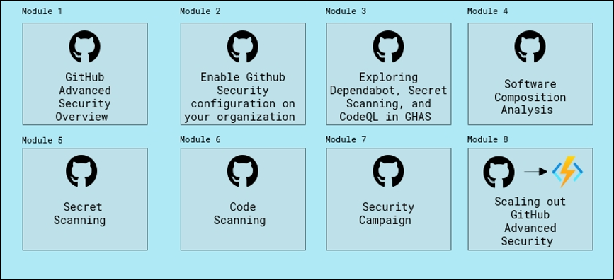

## Explanation of Components

1. **GitHub Secret Protection**, which includes features that help you detect and prevent secret leaks, such as secret scanning and push protection.

1. **GitHub Code Security**, which includes features that help you find and fix vulnerabilities, like code scanning, premium Dependabot features, and dependency review.

1. **Secret Scanning:** Detect secrets, for example keys and tokens, that have been checked into a repository and receive alerts.

2. **Code Scanning:** Search for potential security vulnerabilities and coding errors in your code using CodeQL or a third-party tool.

3. **Dependabot:** Dependabot is an automated dependency management tool that ensures a constant update of project dependencies. Dependabot keeps the development environment safe and steady by fixing bugs found in outdated dependencies.

1. **Copilot Autofix:** Get automatically generated fixes for code scanning alerts.

1. **Security campaigns:** Reduce security debt at scale.

1. **Function App:** It is a serverless compute service that enables you to run event-driven code without managing infrastructure. It automatically scales and executes functions in response to triggers like HTTP requests, timers, or webhooks.

## Accessing Your Lab Environment
 
Once you're ready to dive in, your virtual machine and guide will be right at your fingertips within your web browser. To complete the lab, utilize this virtual machine during the session.
 
   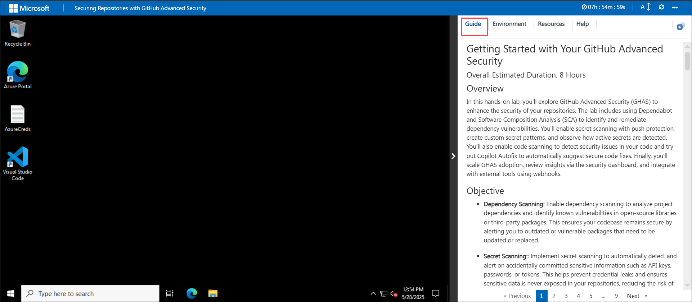

## Virtual Machine & Lab Guide
 
Your virtual machine is your workhorse throughout the workshop. The guide is your roadmap to success.

## Exploring Your Lab Resources
 
To get a better understanding of your lab resources and credentials, navigate to the **Environment** tab. Here, you will find the Azure credentials. Click on the **Environment** option to verify the credentials.

   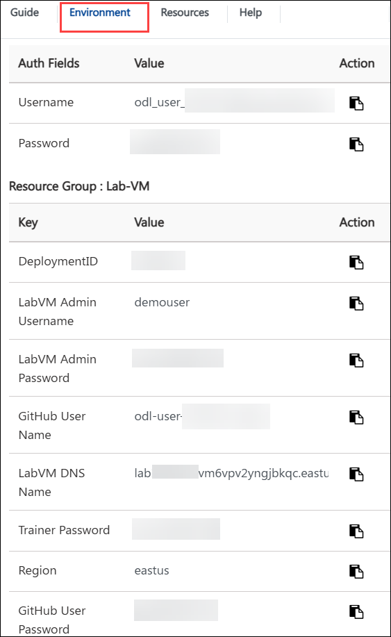

## Utilizing the Split Window Feature
 
For convenience, you can open the lab guide in a separate window by selecting the **Split Window** button from the top right corner.
 
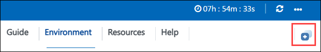
 
## Managing Your Virtual Machine
 
1. Feel free to start, stop, or restart your virtual machine as needed from the **Resources** tab. Your experience is in your hands!
 
   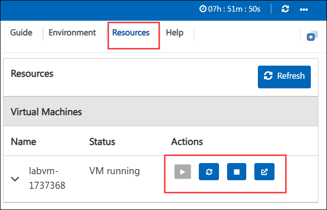    

1. Feel free to use Zoom in/Zoom out option in your respective browser to view the integrated environment clearly and to get the complete options in GitHub & VS Code.

    

## Login to GitHub

1. In the LABVM desktop, search for **Microsoft Edge** **(1)**, click on **Microsoft Edge** **(2)** browser.

   

   >**Note**: On the Welcome to Microsoft Edge page, select  **Start without your data**, on **Stay current with your browsing data** select **Confirm and continue** and on the help for importing Google browsing data page, select the  **Continue without this data**  button. Then, proceed to select  **Confirm and start browsing**  on the next page
has a context menu.

1. Copy the link and open it in a browser window to log in to GitHub 

   ```
   https://github.com/login
   ```

1. On the **Sign in to GitHub** tab, you will see the login screen.

    - Enter your **GitHub username** **(1)** as:
    
      ```
      <inject key="GitHub User Name" enableCopy="true"/>
      ```
    
    - Click on **Sign in with your identity provider** **(2)** to continue .

       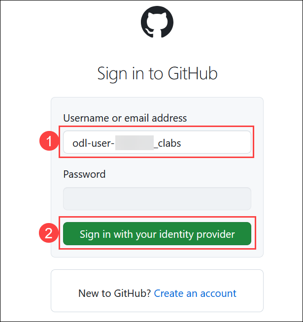

1. Click on **Continue** on the **Single sign-on to CloudLabs Organizations** page to proceed.

     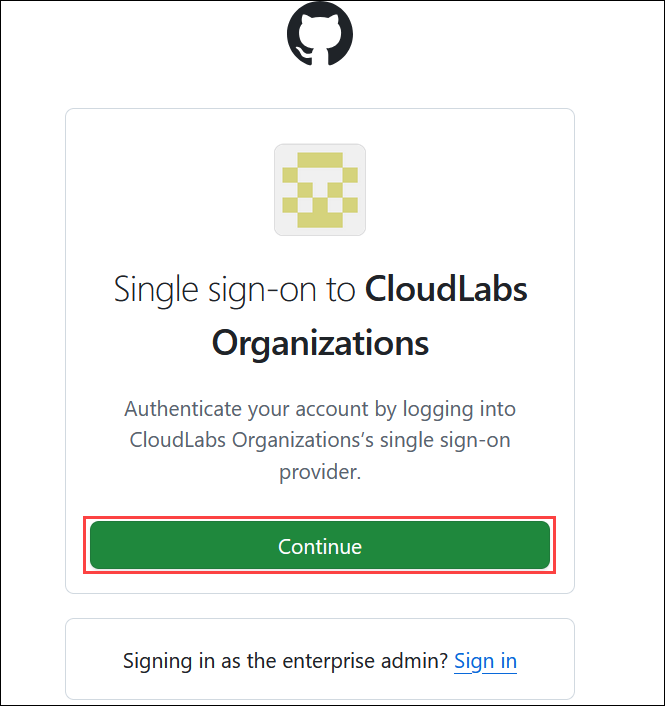

1. You'll see the **Sign in** tab. Here, enter your Azure Entra credentials:
 
   - **Email/Username:** <inject key="AzureAdUserEmail"></inject>
 
        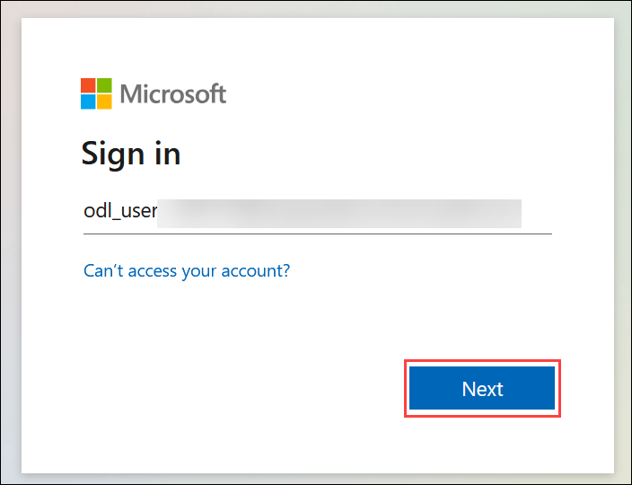
 
1. Next, provide your password to login:
 
   - **Password:** <inject key="AzureAdUserPassword"></inject>
 
        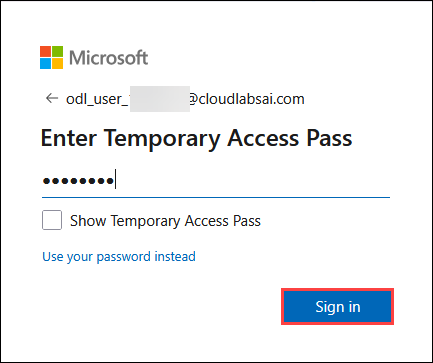

1. Click on **Accept**.

   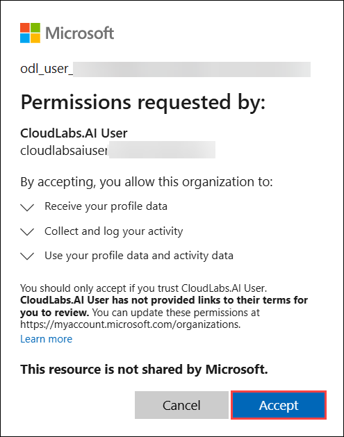

1. If prompted to stay signed in, you can click **No**.

   

1. You are now successfully logged in to GitHub and have been redirected to the GitHub homepage.

   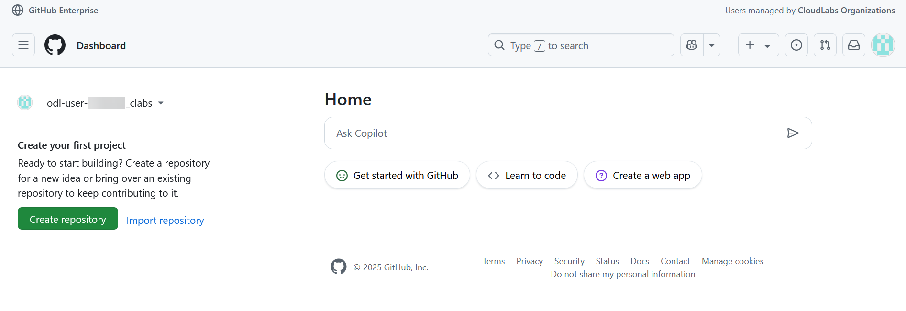

## Support Contact

The CloudLabs support team is available 24/7, 365 days a year, via email and live chat to ensure seamless assistance at any time. We offer dedicated support channels tailored specifically for both learners and instructors, ensuring that all your needs are promptly and efficiently addressed.

Learner Support Contacts:

- Email Support: cloudlabs-support@spektrasystems.com
- Live Chat Support: https://cloudlabs.ai/labs-support

Now, click on **Next** from the lower right corner to move on to the next page.

   

## Happy Learning!!