# Module 02: Enable Github Security configuration on your organization

### Estimated Duration: 20 Minutes

## Lab Scenario

In this module, you will apply security configurations to your organization's repositories to enable key GitHub Advanced Security features—Dependabot, Code Scanning, and Secret Scanning—helping to reduce security risks across your projects.

## Lab Objectives
In this module, you will perform:

- Task 1: Applying security settings in your organization
- Task 2: Activate Actions for All Repositories
- Task 3: Enabling Copilot Autofix for Code Scanning

## Architecture Diagram

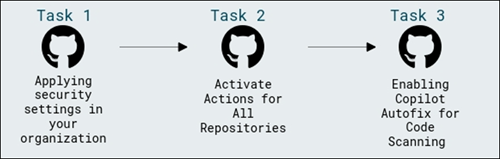

## Task 1: Applying security settings in your organization.

In this task, you will apply GitHub’s recommended security settings across your organization’s repositories to enable key features like Dependabot, secret scanning, and code scanning, helping reduce security risks and improve overall repository protection.

### About the security configuration

The GitHub-recommended security configuration is a collection of enablement settings for GitHub's security features that is created and maintained by subject matter experts at GitHub. The GitHub-recommended security configuration is designed to successfully reduce the security risks for low- and high-impact repositories. We recommend you apply this configuration to all the repositories in your organization.

Applying the security configuration to all repositories in your organization

1. On the **Home** page, click on your profile icon in the top right corner.

   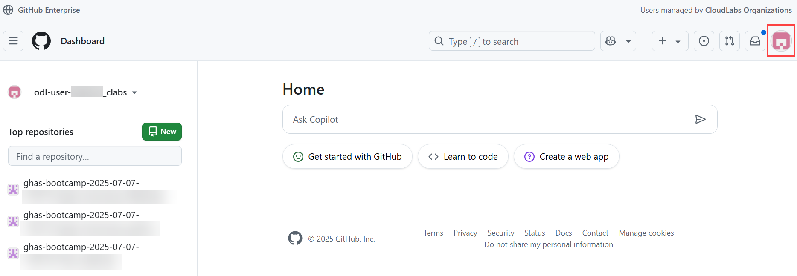

1. Select **Organizations** from the dropdown menu.

   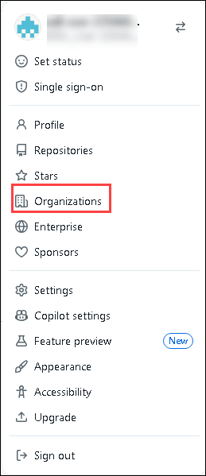

1. Choose **ghas-bootcamp-xxxx-xx-xx-<inject key="DeploymentID" enableCopy="false"/>** from the list of organizations.

   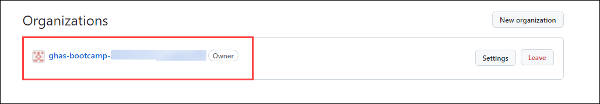

1. From the top navigation bar, go to the top right corner and click on the **Settings** tab

   

1. In the Settings menu, click-on **Configurations (2)** under **Advanced Security (1)** from the Security section.

   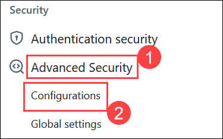

1. Click on **New Configuration** to start creating a Advance Security configuration for the repository.

   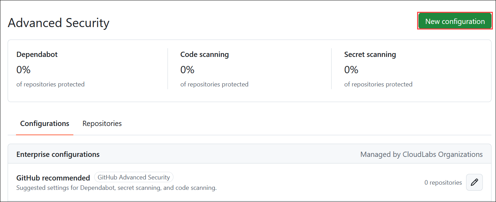

1. The **Name** field should be filled with **Security_settings_enable_<inject key="DeploymentID" enableCopy="false"/>** **(1)**, which identifies the configuration's purpose. The **Description** should be `Settings for Dependabot, secret scanning, and code scanning`**(2)**, offering a brief overview of what the configuration will accomplish.

   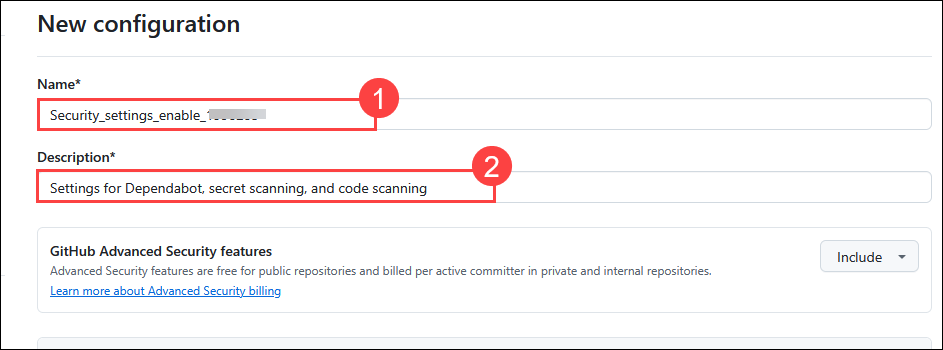

1. In the New configuration window, review the configuration settings and select **Custom configuration** to continue creating an organization-level security configuration.

   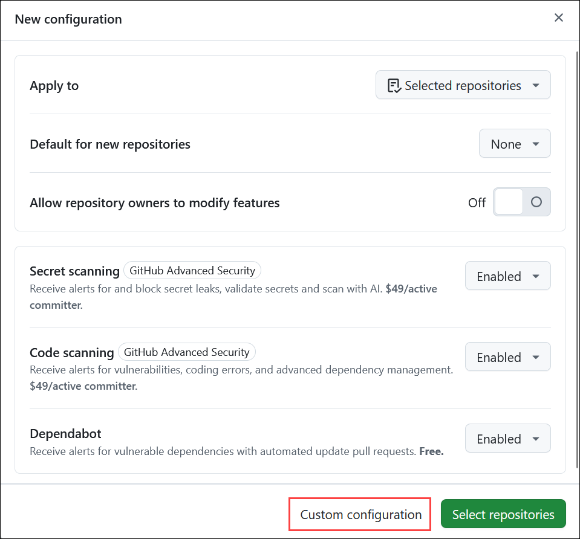

1. In the **Secret scanning** section. You'll find that some options are enabled by default.

   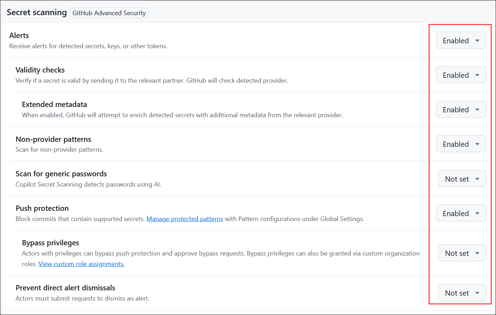

1. Leave the **Alerts** option set to **Enabled (1)**, and change the remaining options to **Not set (2)**.

   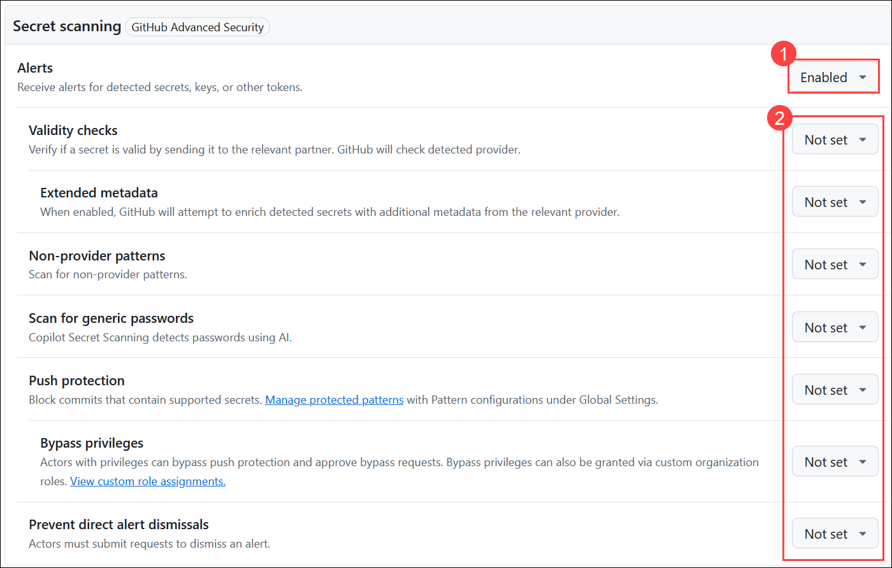

1. Scroll down to the **Code Scanning** section, the default setup for Code Scanning is **Enabled**.

   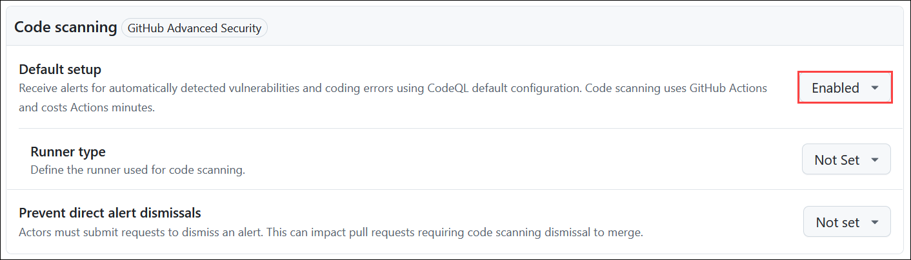

1. Scroll down to the **Dependency scanning** section. You'll find that all options are **Enabled** by default. However, you have the flexibility to adjust these settings. You can modify the options to **Enable**, **Disable**, or leave them as **Not set** based on our requirements or preferences.

   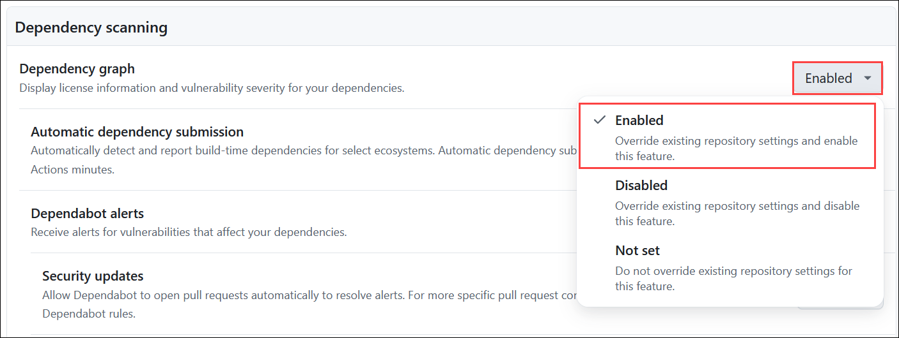
   
   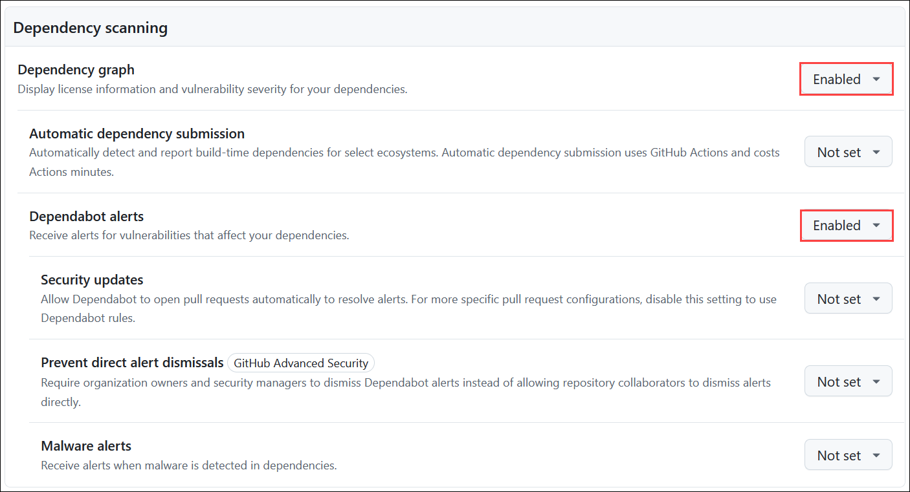

   >**Note:** In this step, we will leave the settings at their default values.

1. In the **Policy** section, next to **Enforce configuration**, select **Don't enforce** from the dropdown menu.

   

1. Finally, click **Save configuration** to apply your changes.

   

1. On the **Apply Configuration** page, select **4 of 5 repositories (1)**, making sure to exclude the **.github** public repository. Then, click on **Apply configuration (2)** to apply the settings across all repositories. Next, select **Security_settings_enable_<inject key="DeploymentID" enableCopy="false"/>** **(3)** and click **Apply (4)** when prompted. This will activate Security alerts for all repositories in your organization, helping to detect any exposed secrets or sensitive information.

   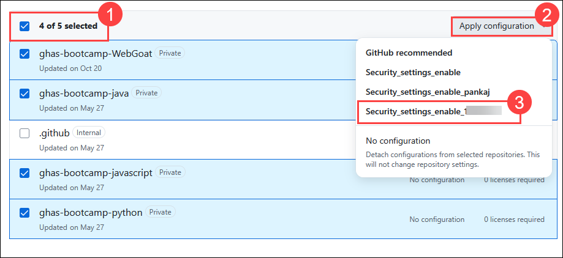

   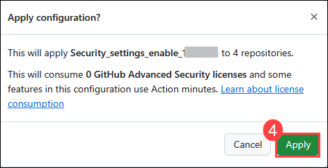

1. You will find that the organization configurations for **Security_settings_enable_<inject key="DeploymentID" enableCopy="false"/>** are enforced on 4 repositories.

   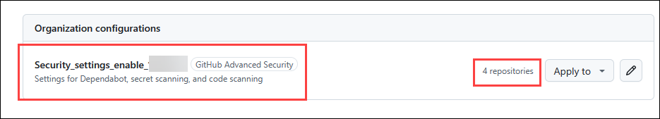

   >**Note:** If it’s not visible, please refresh your page.

1. In the **ghas-bootcamp-xxxx-xx-xx-<inject key="DeploymentID" enableCopy="false"/>** organization, click on **Repositories** from the top navigation pane.

   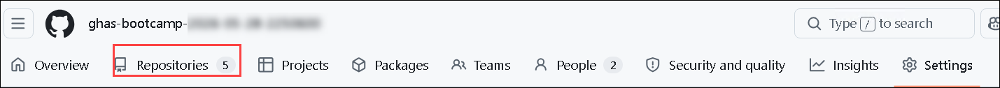

1. From the list of repositories, click on **ghas-bootcamp-WebGoat** to begin working through this module. 

   

1. To review, navigate to your repository’s **Security and quality** tab.

   

1. Here, you can review your alerts in the security overview.

   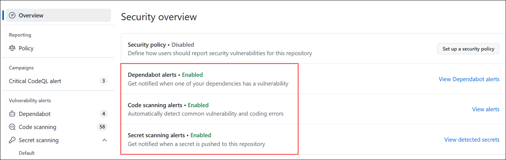

   >**Note:** Here, you will find that the security features are enabled for the repository present in the organization. You will also find this in other repositories, and you are free to check them as well.

## Task 2: Activate Actions for All Repositories

In this task, you will enable GitHub Actions for all repositories in your organization by configuring settings to allow all actions and reusable workflows, ensuring seamless automation of build, test, and deployment pipelines.

GitHub Actions is a continuous integration and continuous delivery (CI/CD) platform that allows you to automate your build, test, and deployment pipeline. You can create workflows that run tests whenever you push a change to your repository, or that deploy merged pull requests to production. You will learn how to enable GitHub Actions for repositories to ensure workflows run seamlessly. This includes configuring the settings to allow all actions and reusable workflows.

1. Select your organization **ghas-bootcamp-xxxx-xx-xx-<inject key="DeploymentID" enableCopy="false"/>**.

   

1. Click the **Settings** tab located in the top navigation bar.

   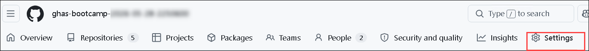

1. In the Settings menu, under the **Code, planning, and automation** section, click **Actions (1)**, and then select **General (2)**.

   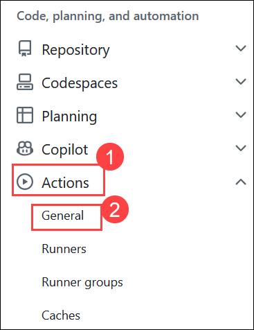

1. Select **Allow all actions and reusable workflows (1)**, and then click **Save (2)** to apply the changes.

   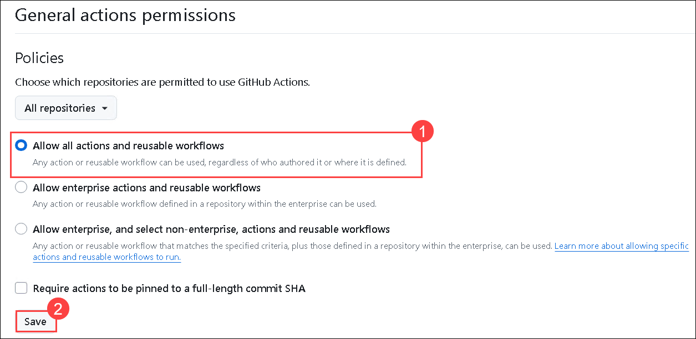

   >**Note:** Make sure to click on the **Save** button, even if **Allow all actions and reusable workflows** is already selected.

## Task 3: Enabling Copilot Autofix for Code Scanning

In this task, you will navigate to your organization’s **Settings** and enable **Copilot Autofix** under the **Code Scanning** section. This ensures that AI-powered automated fixes are available across your organization, enhancing the remediation of security vulnerabilities.

1. In your organization's **Settings** menu, click-on **Global settings (2)** under **Advanced Security (1)** from the Security section.

   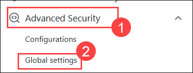

1. Under the **Code Scanning** section, please ensure that **Copilot Autofix** is enabled across your entire organization.

   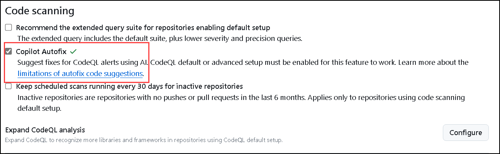

## Summary

In this module, you have completed the following:

- Applying security settings in your organization
- Activate Actions for All Repositories
- Enabled Copilot Autofix for Code Scanning

### You have successfully completed the module. Now, click on **Next >>** from the lower right corner to move on to the next page.
       
 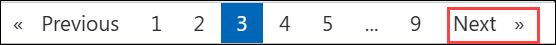
