# Module 07: Security Campaign

### Estimated Duration: 30 minutes

## Lab Scenario

In this lab, we’ll cover a series of tasks designed to provide a comprehensive understanding of creating, launching, tracking, and managing security campaigns.

## Lab Objectives
In this lab, you will perform:

- Task 1: Creating security camapaign
- Task 2: Tracking Security Campaign
- Task 3: Editing and Managing Security Campigns

## Architecture Diagram

   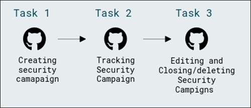

## Task 1: Creating Security Camapaign

In this task, you will create a security campaign using GitHub Security features to identify and fix critical CodeQL vulnerabilities across repositories. This helps prioritize and remediate high-risk issues at scale using Copilot Autofix, improving codebase security and reducing technical debt.

**Security Campaigns:** [GitHub Security Campaigns](https://docs.github.com/en/enterprise-cloud@latest/code-security/code-scanning/managing-code-scanning-alerts/fixing-alerts-in-security-campaign) are a feature within GitHub Advanced Security designed to help teams address security vulnerabilities at scale. These campaigns use Copilot Autofix to suggest fixes for up to 1,000 code scanning alerts at a time, allowing developers and security teams to collaborate efficiently. By prioritizing and fixing these alerts, teams can significantly reduce security debt and improve the overall security of their codebase

1. Select the **ghas-bootcamp-xxxx-xx-xx-<inject key="Deployment-id" enableCopy="false"/>** organization from the top.

   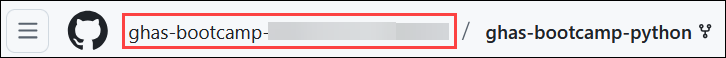

1. Click the **Security** tab from the top right corner of the navigation bar

   

1. In the left sidebar, click on the **Campaigns (1)**, click on **Create campaign (2)** and select **From template (3)**.

    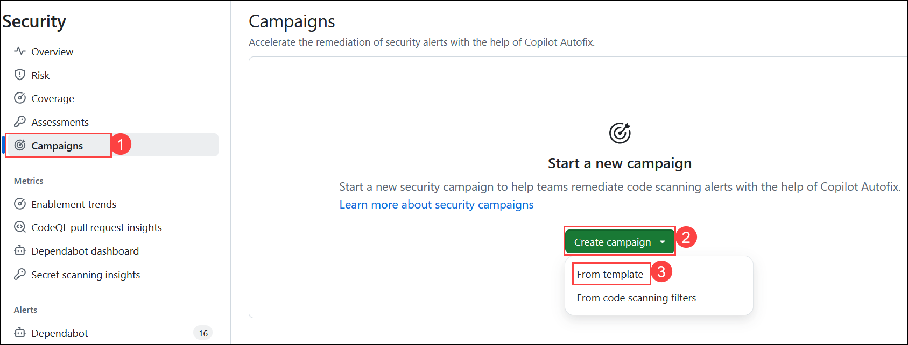

1. Choose **Critical CodeQL Alert** template to use for the campaign.

   - **Critical CodeQL Alert:** It indicates a severe security vulnerability detected by GitHub's CodeQL analysis. CodeQL is a powerful semantic code analysis engine that identifies potential security issues in your codebase. Critical alerts often require immediate attention to prevent exploitation12.

   - **MITRE Top 10 KEV:** The MITRE Top 10 Known Exploited Vulnerabilities (KEV) list highlights the most critical and frequently exploited software weaknesses. These weaknesses are prioritized based on their prevalence and potential impact34. This reduces risk, prevents breaches and can help protect sensitive data.

   - **SQL Injection (CWE-89):** It occurs when an application improperly neutralizes special elements in SQL commands. This allows attackers to manipulate SQL queries, potentially leading to unauthorized data access or modification. Mitigations include using parameterized queries, prepared statements, and input validation

   - **Cross-Site Scripting (CWE-79):** It involves injecting malicious scripts into web pages viewed by other users. This can lead to data theft, session hijacking, or defacement. Preventing XSS involves proper input validation, output encoding, and using security frameworks that automatically handle these issues78.

   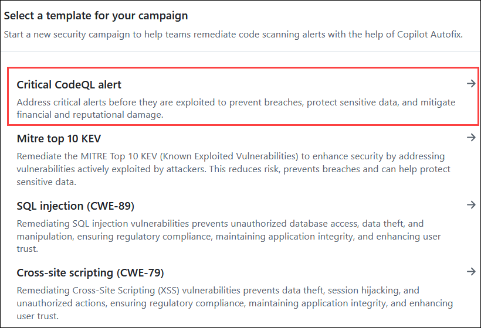

1. At the top right of the campaigns page, click **Save as (1)**, then select **Published campaign (2)** from the dropdown menu.

   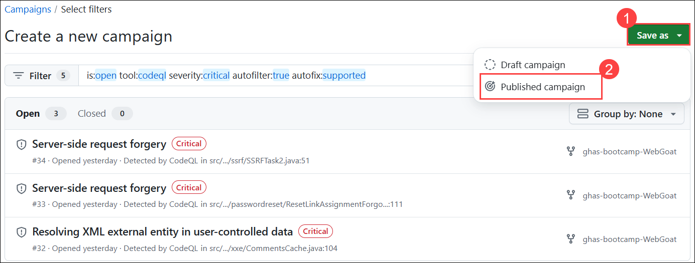

1. Edit the **Campaign name** and **Short description**, define a **Campaign due date**, assign a **Campaign manager** as the primary contact, and finally, click **Create campaign** to initiate it.

   - Enter a **Campaign name** — **Critical CodeQL alert (1)**.

   - Write a **Short description (2)** — Explain the purpose and urgency of the campaign.

   - Set the **Campaign due date** — Select the desired deadline from the **calendar picker (3)**.

   - Select **Campaign managers (4)** — Assign responsible users or teams from the dropdown.

   - Click **Publish campaign (5)**

    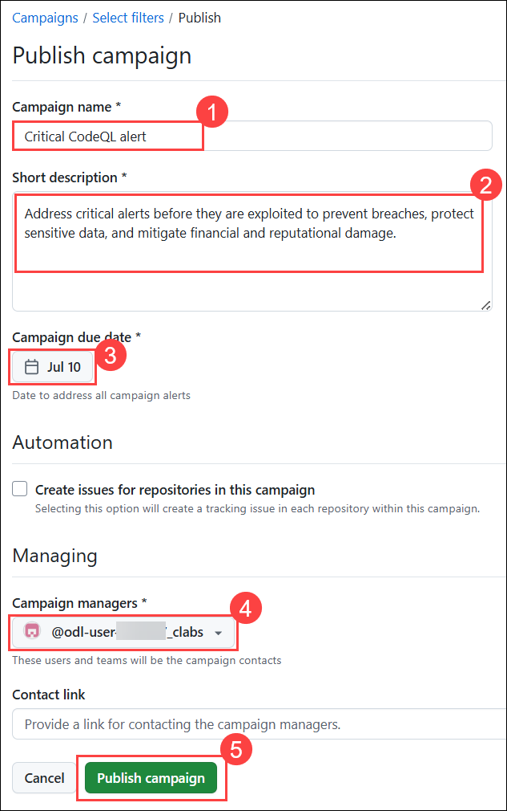

8. It will display all the CodeQL Critical Alerts; next, open the dropdown for **ghas-bootcamp-WebGoat** to view its alerts.

    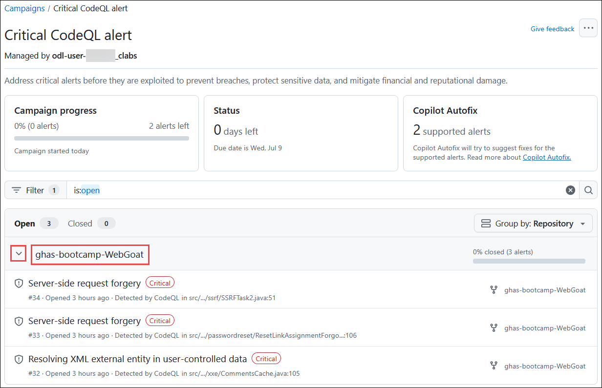

1. Now, click on the first **Server-Side request forgery** issue.

    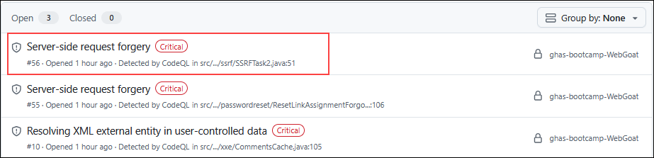

1. Click **Commit to new branch** to save the autofix changes in a new branch for review.

    

   >**Note:** There is a chance that the option to **Commit** may not appear. In this case, look for the **Generate Fix** option, click on it, and once the fix is generated, you will be able to commit.

10. Select the option to **Open a pull request (1)**, then click **Commit change (2)**.

    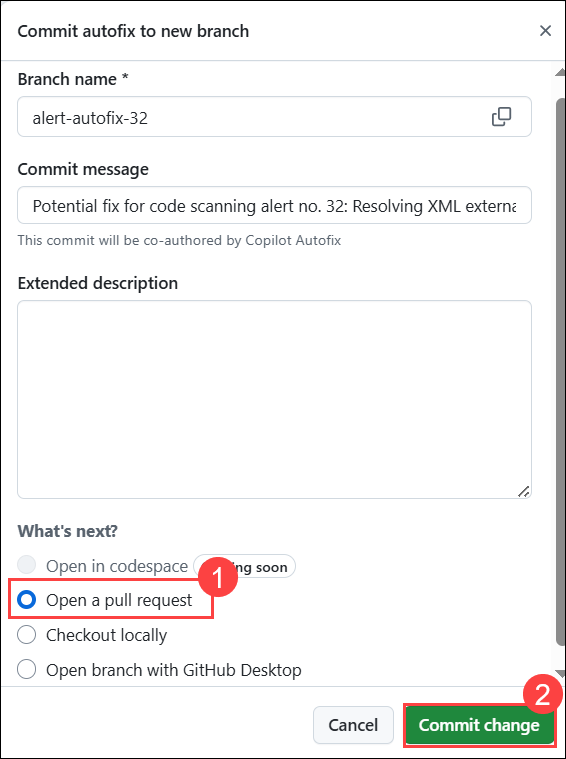

11. Click on **Ready for review**.

    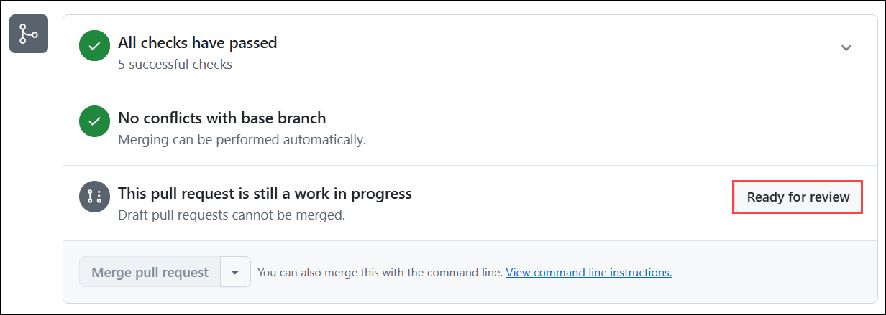

12. Click on **Merge pull request (1)** to finalize and integrate the changes into the main branch, then click on **Confirm merge (2)**.

    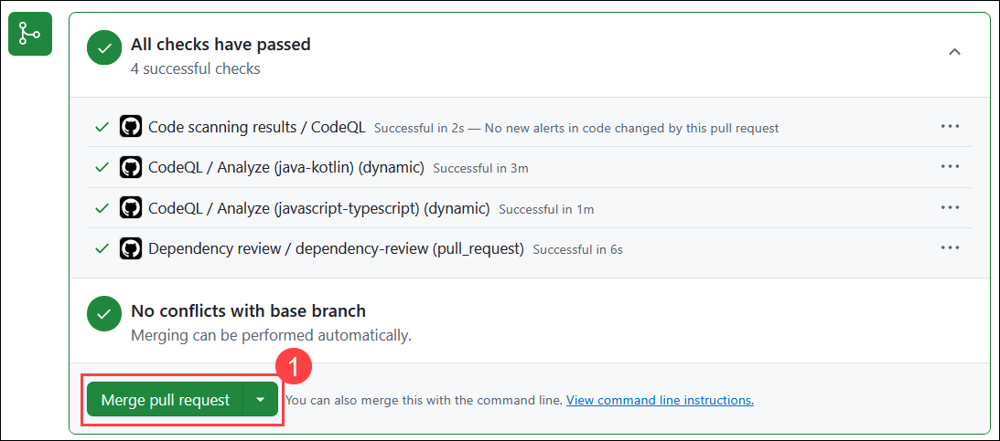
    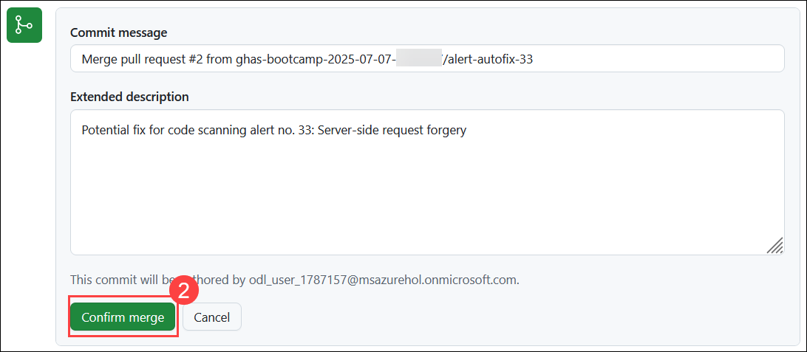

## Task 2: Tracking Security Campaign

In this task, you will monitor the status of your security campaign to ensure vulnerabilities are being fixed. You'll track open and closed alerts, apply autofixes where available, and manage progress through the campaign dashboard.

When you create a campaign, the campaign tracking view is displayed and the campaign is listed in the sidebar of the **Security** tab for the organization. You can redisplay the campaign tracking view at any time by selecting it in the sidebar under "Campaigns".

 Here, you can view the details of the **Campaign's progress** and **Status**, along with the alerts supported by **Copilot Autofix**.

- **In progress:** when at least one branch or pull request is created to fix the alert through the campaign view or the alert page.
- **Closed:** when the alert is fixed or dismissed, even if the development work was done outside the campaign framework.

   

   

   >**Note:** It will take upto 5-30 minutes to get it complete. If fix doesn't work the first time, try the process again and wait for 5 minutes before retrying. Sometimes it takes a few moments for GitHub Copilot to process and generate the fix.
   
   >**Note:** If you move to the next alert before completing the previous fix suggestion, you may encounter a message stating that the fix suggestion was discarded due to new code being pushed. In this case, you’ll need to generate the fix again.

1. Navigate to the **ghas-bootcamp-WebGoat** repository from the repository section. Select **Security (1)** from the top menu, then click on **Critical CodeQL alert (2)** under Campaigns. Here, you will see that **One of the alerts havs been closed (3)**.

   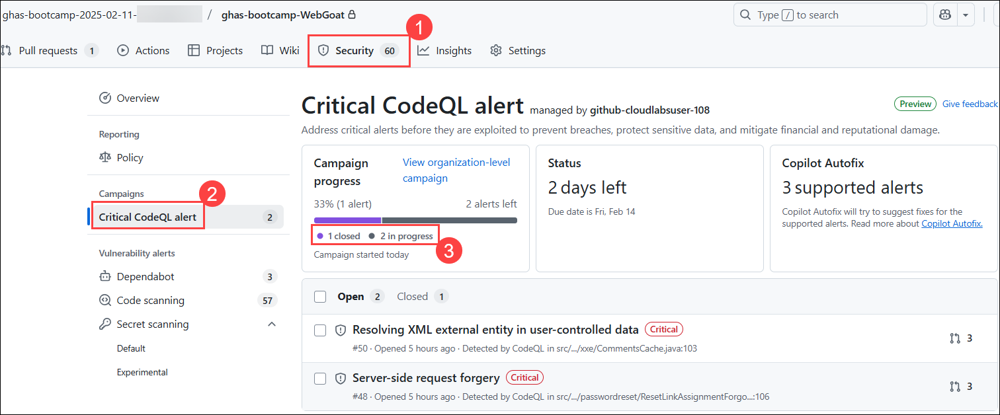

   > **Note:** This status will also be reflected on the Security Campaign page, but it may take a few minutes to update.

1. Click on the open alert **Resolving XML external entity in user-controlled data** to view the details of the vulnerability.

   

1. On the selected alert page, click **Commit to new branch** to apply the autofix and create a new branch with the changes.

   

   >**Note:** There is a chance that the option to **Commit to new branch** may not appear. In this case, look for the **Generate Fix** option, click on it, and once the fix is generated, you will be able to commit.

1. Select the option to **Open a pull request (1)**, then click **Commit changes (2)**.

    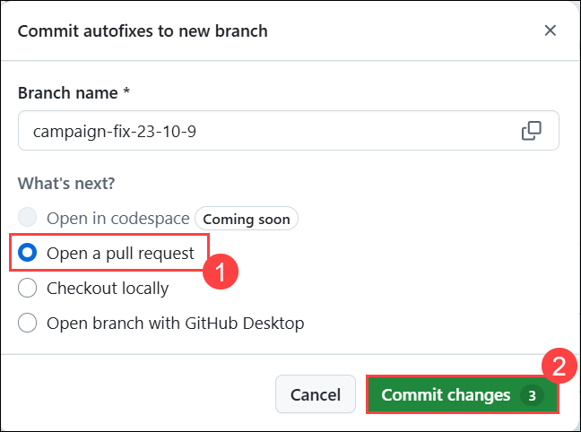

1. Click on **Ready for review**.

    

1. Click on **Merge pull request (1)** to finalize and integrate the changes into the main branch, then click on **Confirm merge (2)**.

    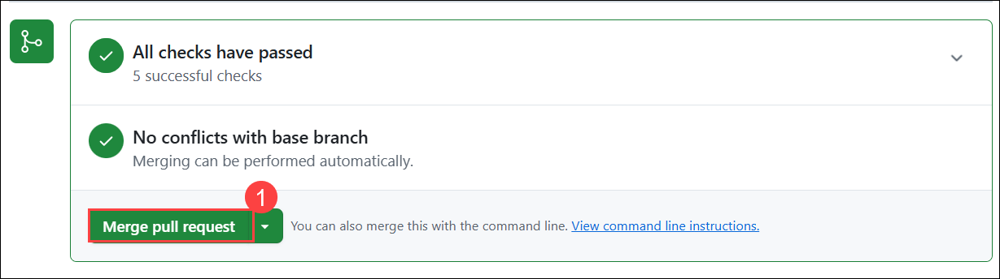
    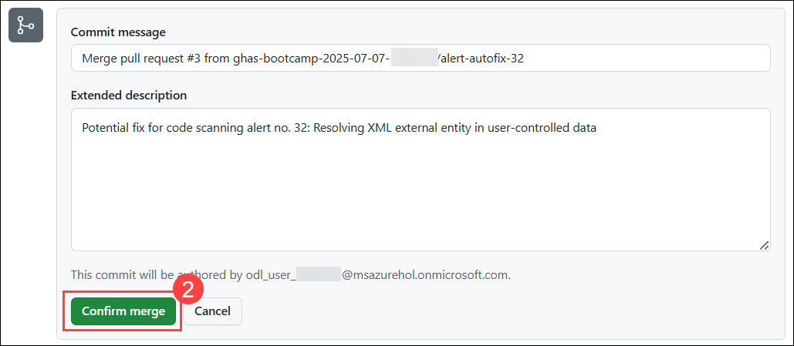

1. Now try refreshing the page.

1. Now you can see that the alert has been closed.

   

   

   > **Note:** This status will also be reflected on the Security Campaign page, but it may take a **5-30 minutes** to update. Refresh the page to get recent update.

1. Now, click on the remaining **alert** and follow the same steps as before to generate a fix.

   

   > **Note:** There is a chance also you can see that you will not be able to close it as the **Copilot Autofix attempted to generate an autofix for this alert, but wasn't able to**. It entirely depends on the type of alert and whether GitHub Copilot is capable of generating a fix for it.

   

## Task 3: Editing and Managing Security Campigns

In this task, you will edit and manage an existing security campaign by updating its details, closing it when completed, or deleting it if no longer needed. This helps keep your campaign list organized and ensures active focus on unresolved security issues.

There is a limit of 10 active campaigns. When a campaign is complete, or if you want to pause it, you should close it. When you close a campaign, it's no longer displayed for developers in the repository Security tab but you can still display the campaign tracking view to develop best practice. In addition, you can reopen a closed campaign from the "Closed campaigns" view, which is accessible from the sidebar in the Security tab of the organization.

1. On GitHub, navigate to the main page of the organization.

   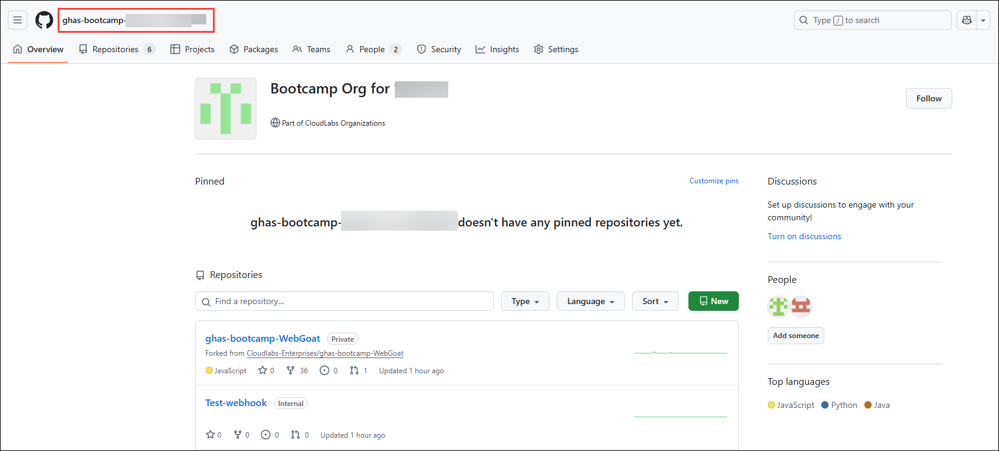

1. Under your organization name, Click the **Settings** tab from the top right corner of the navigation bar.

   

1. In the sidebar, select **Campaigns (1)** click the name of the campaign **Critical CodeQL alert (2)** to display the campaign tracking view.

   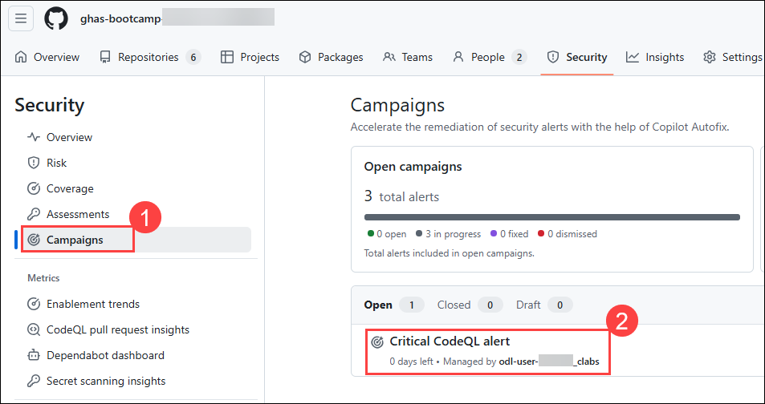

1. Click the three-dot menu **(⋯) (1)** in the top-right corner and select **Edit campaign (2)** to modify the campaign settings.

   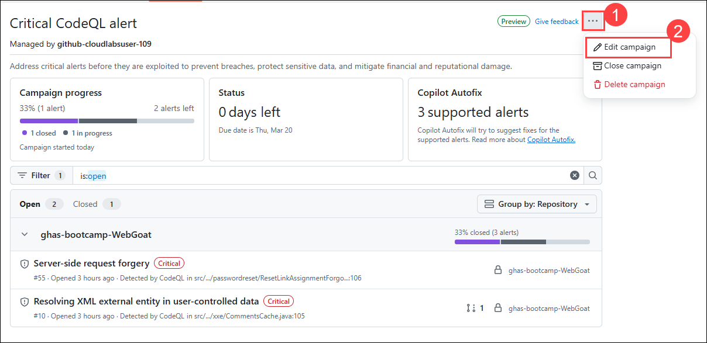

1. In the **Edit Campaign** section, you can update the **Campaign name (1)**, **Short description (2)**, **Campaign due date (3)**, and **Campaign managers (4)**. Once done, click on **Save changes (5)** to apply the updates.

   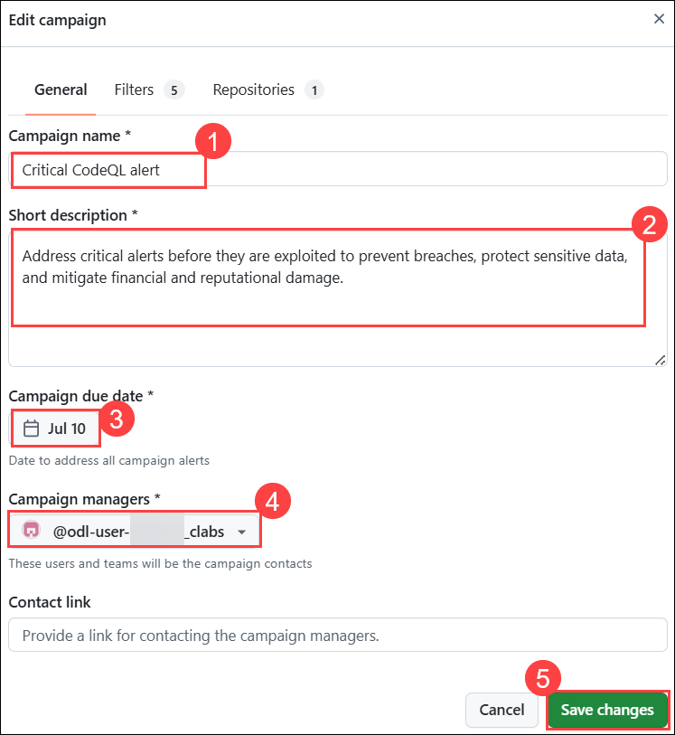

1. For deleting or closing the campaign select the required option **close campaign** or **delete campaign** by selecting the campaign.

- **Close campaign** to remove it from the active campaigns list and display it on the Closed campaigns view.

- **Delete campaign** to delete the campaign permanently. In the "Delete campaign" dialog, click Delete to confirm that you want to delete the campaign.

   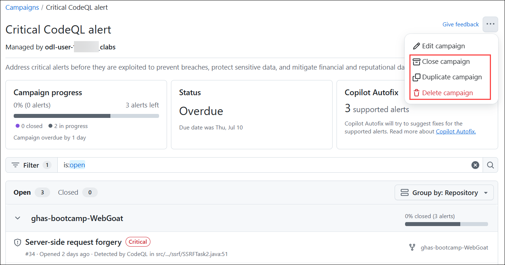

## Summary
In this lab you have completed the following:

- Created a campaign from a template
- Tracked Security Campaigns
- Edited and Managed Security Campigns

### You have successfully completed the lab.

Now, click on **Next >>** from the lower right corner to move on to the next page.
            
 
